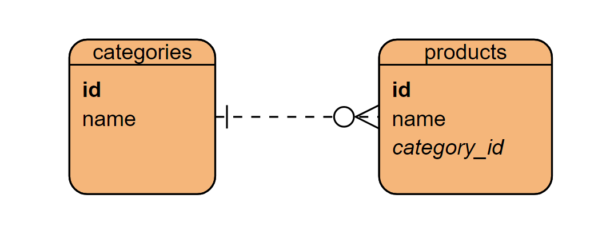

# N+1 query problem
* JPA/Hibernate
* Spring Boot
* Testcontainers / PostgreSQL

## Model


## Data
* 4 categories
* 100 products per category

## Test method
```java
pl.net.redit.nplusonequery.NPlusOneQueryApplicationTests.nPlusOne
```

## Run Linux
```bash
export JAVA_HOME=[path to jdk 17]
./gradlew --no-build-cache clean test --info
```
## Run Windows
```bash
set JAVA_HOME=[path to jdk 17]
gradlew --no-build-cache clean test --info
```

## See logs
```sql
--- start selects ---
--- category select query ---
Hibernate:
select
    c1_0.id,
    c1_0.name
from
    categories c1_0
--- number of categories 4 ---

--- product select query [category id: 1] ---
Hibernate:
select
    p1_0.category_id,
    p1_0.id,
    p1_0.name
from
    products p1_0
where
    p1_0.category_id=?
--- number of products: 100; [category id: 1] ---

--- product select query [category id: 102] ---
Hibernate:
select
    p1_0.category_id,
    p1_0.id,
    p1_0.name
from
    products p1_0
where
    p1_0.category_id=?
--- number of products: 100; [category id: 102] ---

--- product select query [category id: 203] ---
Hibernate:
select
    p1_0.category_id,
    p1_0.id,
    p1_0.name
from
    products p1_0
where
    p1_0.category_id=?
--- number of products: 100; [category id: 203] ---

--- product select query [category id: 304] ---
Hibernate:
select
    p1_0.category_id,
    p1_0.id,
    p1_0.name
from
    products p1_0
where
    p1_0.category_id=?
--- number of products: 100; [category id: 304] ---
```
n queries for products + 1 for categories